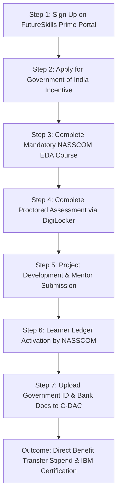

# Internship Dossier: IBM Collaborative Project-Based Experiential Learning (PBEL)

**Candidate Name:** Vaibhav Gupta  
**Program:** IBM Collaborative Project-Based Experiential Learning (PBEL)  
**Specialization Track:** Full Stack Web Development with JavaScript  
**Partner Institutions:** IBM, IT-ITeS Sector Skills Council NASSCOM, FutureSkills Prime (MeitY / GOI), C-DAC  
**Assessment Certification ID:** FSP/2026/8/10352348 (Gold Category – 75/100)  
**Primary Repository:** [vaibhv19/IBM-PBEL](https://github.com/vaibhv19/IBM-PBEL)  

---

## Table of Contents
1. [The Internship / Program Itself](#1-the-internshipprogram-itself)
   - [Program Overview & Mandate](#11-program-overview--mandate)
   - [Program Architecture & 7-Step PBEL Workflow](#12-program-architecture--7-step-pbel-workflow)
   - [Course Curriculum Structure](#13-course-curriculum-structure)
   - [Actual Work Executed & Verification Milestones](#14-actual-work-executed--verification-milestones)
   - [Core Skills & Knowledge Acquired](#15-core-skills--knowledge-acquired)
2. [Projects Completed During the Internship](#2-projects-completed-during-the-internship)
   - [Project 1: Food Ordering System (L'Étoile Monospaced)](#21-project-1-food-ordering-system-létoile-monospaced)
   - [Project 2: E-Commerce Web Application](#22-project-2-e-commerce-web-application)
   - [Project 3: Social Media Platform Backend](#23-project-3-social-media-platform-backend)
   - [Project 4: Client-Side Weather Application](#24-project-4-client-side-weather-application)
3. [Related Repositories, Ecosystem Assets & Ownership Attribution](#3-related-repositories-ecosystem-assets--ownership-attribution)
   - [Code of Conduct & Institutional Guidelines](#31-code-of-conduct-coc--institutional-guidelines)
   - [Internship Tracking Repository (`IBM-PBEL`)](#32-internship-tracking-repository-ibm-pbel)
   - [Bot & Automated Tooling Systems](#33-bot--automated-tooling-systems)
   - [Individual Project Repositories](#34-individual-project-repositories)
   - [Strict Ownership & Attribution Matrix](#35-strict-ownership--attribution-matrix)

---

# 1. The Internship/Program Itself

### 1.1 Program Overview & Mandate
The **IBM Collaborative Project-Based Experiential Learning (PBEL)** program is an industry-aligned technical skilling initiative designed by **IBM** in partnership with the **IT-ITeS Sector Skills Council NASSCOM** and the **FutureSkills Prime (FSP)** platform (a joint initiative by the Ministry of Electronics and Information Technology [MeitY], Government of India, and NASSCOM).

The program aims to bridge the gap between academic theory and industry engineering standards. Focusing on **Full Stack Web Development with JavaScript**, it blends structured modular coursework, rigorous government-backed standardized assessments, and mentor-guided capstone engineering projects.

---

### 1.2 Program Architecture & 7-Step PBEL Workflow
The program follows a strict 7-stage compliance and completion pipeline governed by NASSCOM and C-DAC:



1. **Step 1: Sign Up on FutureSkills Prime (FSP) Portal** — Registered official learner account matching legal identification and academic enrollment records.
2. **Step 2: Apply for Government of India (GOI) Incentive** — Submitted application for the Direct Benefit Transfer (DBT) skill incentive scheme under MeitY.
3. **Step 3: Complete Mandatory NASSCOM Coursework** — Enrolled in and completed the foundational *Exploratory Data Analysis (EDA)* course mandatory across all technical tracks.
4. **Step 4: Complete Course Assessment in NASSCOM Portal** — Authenticated identity through DigiLocker and cleared the national-standard certification assessment.
5. **Step 5: Project Submission under Mentor Guidance** — Engineered, documented, and submitted production-ready web application repositories fulfilling the course project tracks.
6. **Step 6: Learner Ledger Activation** — Updated learner status in FSP to transition incentive ledger to *"Incentive in Progress"*.
7. **Step 7: Document Verification on C-DAC Portal** — Uploaded verified photo identification, Aadhaar-linked documentation, and self-attested bank verification for administrative audit and stipend disbursement.

---

### 1.3 Course Curriculum Structure
The official syllabus comprises **50 instructional hours** spanning 6 specialized units plus **10 project hours**:

| Module | Module Title | Hours | Core Topics Covered |
| :--- | :--- | :---: | :--- |
| **Module I** | Frontend Development Basics | 6 | Client-Server architecture, HTML5 semantics, modern CSS3 layouts, TailwindCSS utility styling, DOM manipulation, JS event handling |
| **Module II** | Server-Side Development with Node.js & Express.js | 10 | Asynchronous event loop, NPM ecosystem, Express routing, custom middleware pipelines, EJS server-rendered templates, form parsing |
| **Module III** | Database & API Development | 10 | NoSQL data modeling with MongoDB, Mongoose schemas and ODM CRUD operations, REST API design, JWT authentication, role-based access control |
| **Module IV** | Advanced Frontend with React.js | 10 | React component hierarchy, functional components, hooks (`useState`, `useEffect`), client routing (React Router), global state via Context API, REST consumption |
| **Module V** | Full-Stack Project Development & Deployment | 8 | Monorepo/polyrepo architectures, full-stack REST API integration, cloud deployment pipelines (Vercel/Netlify/Heroku), security hardening, performance profiling |
| **Module VI** | Website Launch and SEO Optimization | 6 | On-page SEO, OpenGraph metadata optimization, semantic structure, content planning, web performance auditing via Google Search Console & Analytics |
| **Projects** | Mentor-Guided Project Tracks | 10 | Development of production-grade reference solutions across 5 project specifications |

---

### 1.4 Actual Work Executed & Verification Milestones
During this program, the candidate personally carried out the following verified tasks:

* **Foundational Course Completion:** Completed the *Exploratory Data Analysis* course on **July 25, 2026** (Certificate issued by IT-ITeS SSC NASSCOM, signed by CEO Dr. Abhilasha Gaur).
* **National Assessment Clearance:** Successfully cleared the formal proctored assessment on **August 5, 2026**, achieving a **Gold Category** designation (Score: 75/100, Certification ID: `FSP/2026/8/10352348` across NSQF Level 5 competencies).
* **Portal & Compliance Execution:** Successfully linked DigiLocker profile, registered on the GOI Incentive portal, and tracked submission status on the FSP portal.
* **Full-Stack Software Development:** Engineered and deployed 4 standalone web development repositories covering all project domains prescribed by the syllabus.

---

### 1.5 Core Skills & Knowledge Acquired
* **Modern JavaScript & TypeScript Patterns:** Asynchronous flows (`async`/`await`, Promises), functional programming, event bubbling, debouncing algorithms.
* **Component-Driven Frontend Engineering:** React functional state management, custom hook composition, Context API global state isolation, and deterministic data rendering.
* **Backend & API Systems:** RESTful architectural patterns, Express.js middleware chaining, JSON Web Token (JWT) token validation, secure password hashing (BCrypt), and session state.
* **NoSQL Database Modeling:** MongoDB schema definition with Mongoose, relational referencing (`populate`), indexing, and transactional integrity.
* **Production Operations & Documentation:** Git version control hygiene, multi-repo tracking, semantic markdown documentation, and API interface design.

---

# 2. Projects Completed During the Internship

The candidate completed four standalone projects mapping directly to the curriculum tracks:

```
├── 1. Food Ordering System (L'Étoile Monospaced)  [React + Vite + Tailwind + TheMealDB]
├── 2. E-Commerce Web Application                  [React + Node.js + Express + MongoDB + DummyJSON]
├── 3. Social Media Backend Platform               [Node.js + Express + MongoDB + EJS]
└── 4. Client-Side Weather Application             [Vanilla JS + HTML5/CSS3 + Open-Meteo APIs]
```

---

### 2.1 Project 1: Food Ordering System (L'Étoile Monospaced)
* **GitHub Repository:** [vaibhv19/Food-Ordering-System](https://github.com/vaibhv19/Food-Ordering-System)
* **Curriculum Alignment:** Module IV (*Advanced Frontend with React.js*) & Module V (*Full-Stack Project Development*)

```
┌─────────────────────────────────────────────────────────────────────────┐
│                      L'ÉTOILE MONOSPACED ARCHITECTURE                   │
├─────────────────────────────────────────────────────────────────────────┤
│                                                                         │
│   ┌─────────────────────┐    ┌──────────────────────────────────────┐   │
│   │ Category Navigation │───▶│ TheMealDB API (Live Dishes & Details)│   │
│   └─────────────────────┘    └──────────────────────────────────────┘   │
│              │                                   │                      │
│              ▼                                   ▼                      │
│   ┌─────────────────────┐            ┌───────────────────────┐          │
│   │ Responsive Grid UI  │            │ Deterministic Pricing │          │
│   │   (TailwindCSS)     │            │  (Meal ID Hash Map)   │          │
│   └─────────────────────┘            └───────────────────────┘          │
│              │                                   │                      │
│              ▼                                   ▼                      │
│   ┌──────────────────────────────────────────────────────────┐          │
│   │            React Context API (Global Cart State)         │          │
│   └──────────────────────────────────────────────────────────┘          │
│              │                                   │                      │
│              ▼                                   ▼                      │
│   ┌─────────────────────┐            ┌───────────────────────┐          │
│   │  Slide-Out Drawer   │            │ Kitchen Ticket Receipt│          │
│   │ (Guest Check UI)    │            │     (Invoice View)    │          │
│   └─────────────────────┘            └───────────────────────┘          │
└─────────────────────────────────────────────────────────────────────────┘
```

#### Purpose
To develop a simulated restaurant and café web application that delivers an end-to-end interactive ordering journey—from category discovery and ingredient exploration to custom guest-check cart modification and receipt generation.

#### Specific Contribution
* 100% of custom React component hierarchy, application logic, and user experience flows.
* Authored custom vintage-paper aesthetics using TailwindCSS utility layers paired with monospaced typography.
* Conceived and engineered the deterministic client-side pricing generator to synthesize consistent prices without requiring a dedicated pricing backend.

#### Technical Work
* **State Management:** Implemented React Context API to manage an application-wide cart ledger, item modifiers, quantity mutators, and tax/total calculations.
* **Dynamic Modal Overlays:** Engineered a portal-based modal system displaying high-resolution dish assets, ingredient tables, and preparation instructions retrieved from TheMealDB.
* **Deterministic Pricing Algorithm:** Designed a pure hashing function using the numerical meal ID to map external data items to fixed, session-stable dollar prices.
* **Interactive Cart & Receipt Flow:** Built a slide-out drawer simulating a physical restaurant guest check and a simulated kitchen order ticket (KOT) checkout receipt screen.

#### Technology Used
* **Frontend:** React.js (Hooks: `useState`, `useEffect`, `useContext`, `useMemo`), React Router.
* **Styling:** TailwindCSS (custom theme configuration, vintage color palette).
* **Tooling:** Vite build system, ESLint, PostCSS.
* **External Services:** TheMealDB public REST API.

#### Meaningful Result
A zero-latency, highly polished restaurant ordering frontend with complete state persistence and zero runtime backend dependencies.

#### What I Learned
* Advanced state modeling with the React Context API.
* Efficient asynchronous API handling and defensive parsing of unnormalized external payloads.
* Structuring accessible UI components (drawers, modals, tab selectors) without external heavy UI libraries.

---

### 2.2 Project 2: E-Commerce Web Application
* **GitHub Repository:** [vaibhv19/E--commerce-Website](https://github.com/vaibhv19/E--commerce-Website)
* **Curriculum Alignment:** Module III (*Database & API Development*) & Module V (*Full-Stack Project Development*)

#### Purpose
To engineer a full-stack e-commerce catalog and checkout platform supporting user accounts, category filtering, persistent shopping cart sessions, and transaction summary generation.

#### Specific Contribution
* Designed full-stack integration connecting a React client to an Express/MongoDB backend service.
* Authored Mongoose schemas, REST controller endpoints, authentication middleware, and frontend shopping catalog interfaces.

#### Technical Work
* **Backend Architecture:** Express.js REST API with routing modularized into controllers, services, and data models.
* **Database Modeling:** Created Mongoose schemas for `User`, `Product`, `CartItem`, and `OrderTransaction` with validation rules.
* **Authentication Pipeline:** Implemented stateless user authentication using JSON Web Tokens (JWT) stored in secure client headers/cookies.
* **Catalog & State Sync:** Integrated DummyJSON product catalogs for mock inventory, synchronized with local MongoDB order transaction ledgers.

#### Technology Used
* **Frontend:** React.js, TailwindCSS, Axios / Fetch API.
* **Backend:** Node.js, Express.js.
* **Database:** MongoDB, Mongoose ODM.
* **Security & Auth:** JSON Web Tokens (JWT), BCrypt password hashing.
* **API Integration:** DummyJSON API for catalog seeding.

#### Meaningful Result
A complete multi-tier web application demonstrating secure client-server communication, database persistence, and resilient error handling across CRUD operations.

#### What I Learned
* Full-stack data flow from MongoDB document queries through Express middleware to React rendering.
* Security best practices including token validation, CORS configuration, and request sanitization.
* Managing synchronized cart state between client local storage and database instances.

---

### 2.3 Project 3: Social Media Platform Backend
* **GitHub Repository:** [vaibhv19/Social-Media-Backend](https://github.com/vaibhv19/Social-Media-Backend)
* **Curriculum Alignment:** Module II (*Server-Side Development with Node.js & Express.js*) & Module III (*Database & API Development*)

#### Purpose
To develop a server-rendered social media backend and community portal supporting profile creation, post broadcasting, comment threads, user follow networks, and administrative moderation.

#### Specific Contribution
* Sole author of the Express.js application architecture, MongoDB relational schemas, EJS view templates, and session-based authentication flow.

#### Technical Work
* **Server-Side Rendering (SSR):** Built dynamic server-rendered UI pages using the EJS templating engine with partial layouts for headers, navigation, and feeds.
* **Relational NoSQL Design:** Modeled interconnected user relationships (followers, following), post likes, and nested comment structures using Mongoose ObjectIds and `.populate()`.
* **Session Lifecycle:** Configured `express-session` with MongoDB session store for stateful authentication and persistent user logins.
* **Role-Based Access Control (RBAC):** Built custom authorization middleware restricting administrative moderation actions (deleting reported posts, ban users).

#### Technology Used
* **Runtime & Framework:** Node.js, Express.js.
* **View Engine:** EJS (Embedded JavaScript Templates).
* **Database:** MongoDB, Mongoose ODM.
* **Session & Security:** `express-session`, `connect-mongo`, `bcryptjs`.

#### Meaningful Result
A server-rendered, monolithic community application handling user authentication, live relational data operations, and secure role-based interactions.

#### What I Learned
* Core principles of Server-Side Rendering (SSR) versus Single Page Applications (SPAs).
* Efficient relational modeling and index optimization in MongoDB.
* Protecting endpoints using middleware pipelines and session validation.

---

### 2.4 Project 4: Client-Side Weather Application
* **GitHub Repository:** [vaibhv19/Weather-App](https://github.com/vaibhv19/Weather-App)
* **Curriculum Alignment:** Module I (*Frontend Development Basics*)

#### Purpose
To build a lightweight, geolocalized weather telemetry dashboard providing real-time conditions, 7-day meteorological forecasts, and city search autocomplete without third-party framework overhead.

#### Specific Contribution
* 100% of vanilla JavaScript code, DOM manipulation logic, and API integration.
* Implemented client-side input debouncing and asynchronous promise coordination.

#### Technical Work
* **Native Asynchronous JS:** Handled multi-stage asynchronous data retrieval using ES6 `fetch` and `async`/`await` without helper libraries.
* **Debounced Search Autocomplete:** Implemented a debounce timing utility on search inputs to minimize API payload volume and prevent rate limiting.
* **Geocoding & Forecast Pipelines:** Linked Open-Meteo Geocoding API with Open-Meteo Weather Forecast API to dynamically transform coordinates into temperature, humidity, wind velocity, and UV metrics.
* **Responsive DOM Updating:** Dynamically generated weather metric cards, hourly graphs, and status badges via native DOM manipulation.

#### Technology Used
* **Core:** Vanilla JavaScript (ES6+), HTML5 Semantic markup, CSS3.
* **Styling:** TailwindCSS (via CDN for lightweight client deployment).
* **External APIs:** Open-Meteo Geocoding API & Open-Meteo Forecast REST API.

#### Meaningful Result
A real-time, responsive weather dashboard requiring zero build step, zero authentication keys, and near-instant load performance.

#### What I Learned
* Native browser APIs: `fetch`, Geolocation API, LocalStorage.
* Debouncing and throttling techniques for rate-limited public APIs.
* Writing clean, modular, and unbundled vanilla JavaScript code.

---

# 3. Related Repositories, Ecosystem Assets & Ownership Attribution

To uphold academic integrity and engineering transparency, this section strictly categorizes every repository, artifact, and framework associated with the internship.

```
┌────────────────────────────────────────────────────────────────────────┐
│                        ECOSYSTEM OWNERSHIP SPECTRUM                    │
├────────────────────────────────────────────────────────────────────────┤
│                                                                        │
│  [INSTITUTIONAL / PROGRAM]       [SHARED / HYBRID]     [INDIVIDUALLY OWNED]
│  ├── PBEL Curriculum/Syllabus    ├── Project Specs     ├── L'Étoile Monospaced
│  ├── NASSCOM EDA Coursework      └── Template Schemas  ├── E-Commerce App     
│  ├── C-DAC Verification Rules                          ├── Social Media App   
│  └── Assessment Portals                                ├── Weather Dashboard  
│                                                        └── Tracking Repo      
└────────────────────────────────────────────────────────────────────────┘
```

---

### 3.1 Code of Conduct (COC) & Institutional Guidelines
* **Originating Bodies:** IBM, IT-ITeS SSC NASSCOM, FutureSkills Prime, MeitY (Government of India).
* **Scope & Contents:**
  * Strict academic integrity and anti-plagiarism guidelines for project submissions.
  * DigiLocker authentication mandates for legitimate learner identity verification.
  * Standardized evaluation criteria across the 6 technical modules and NSQF Level 5 competencies.
  * Direct Benefit Transfer (DBT) documentation rules governed by C-DAC.
* **Attribution:** **100% Program-Provided.** The candidate acted as an adherent and participant complying with these standards.

---

### 3.2 Internship Tracking Repository (`IBM-PBEL`)
* **Repository:** [vaibhv19/IBM-PBEL](https://github.com/vaibhv19/IBM-PBEL)
* **Scope & Contents:**
  * Master tracking repository documenting syllabus reference materials (`syllabus.pdf`), step-by-step workflow procedures (`PBEL_Process.pdf`), and portal registration proof (`ScreenShots/`).
  * Stores verified course completion and gold-level assessment certificates (`Certificate/`).
  * Index linking all completed project repositories.
* **Attribution:** **Candidate Curated & Maintained.** Contains program-issued reference documents (`syllabus.pdf`, `PBEL_Process.pdf`) curated, organized, and tracked by the candidate.

---

### 3.3 Bot & Automated Tooling Systems
* **Scope & Context:**
  * Any references to AI assistants, scaffolding bots, or automated code tools (such as IBM BoB, SkillsBuild lab assistants, or AI bot frameworks used in training exercises):
* **Attribution & Clarification:**
  * **Platform Bots & Core Scaffolding:** **100% Program / IBM Provided.** The underlying AI models, lab bot infrastructures, and sandbox platforms belong entirely to IBM / Edunet Foundation / SkillsBuild.
  * **User Configurations, Ingestions, & Solution Code:** **Candidate Authored.** Any prompt configurations, workflow pipelines, or applications built on top of these platforms represent candidate-authored technical work.

---

### 3.4 Individual Project Repositories
The table below documents the four dedicated application repositories developed for the PBEL program:

| Repository Name | URL | Scope & Architecture | Ownership Breakdown |
| :--- | :--- | :--- | :--- |
| **Food-Ordering-System** | [github.com/vaibhv19/Food-Ordering-System](https://github.com/vaibhv19/Food-Ordering-System) | React.js restaurant application featuring category selectors, modal inspectors, cart drawer, and receipt ticket. | **100% Candidate Authored.** All React components, state logic, and styling written by candidate. Data consumed from public TheMealDB API. |
| **E--commerce-Website** | [github.com/vaibhv19/E--commerce-Website](https://github.com/vaibhv19/E--commerce-Website) | MERN stack e-commerce platform with JWT authentication, cart state, and order tracking. | **100% Candidate Authored.** Full-stack code written by candidate; DummyJSON used for mock product data. |
| **Social-Media-Backend** | [github.com/vaibhv19/Social-Media-Backend](https://github.com/vaibhv19/Social-Media-Backend) | Node.js, Express, MongoDB, EJS server-rendered social network with sessions and RBAC. | **100% Candidate Authored.** Backend routes, controllers, Mongoose schemas, and EJS views built entirely by candidate. |
| **Weather-App** | [github.com/vaibhv19/Weather-App](https://github.com/vaibhv19/Weather-App) | Vanilla JS weather telemetry dashboard with debounced search autocomplete. | **100% Candidate Authored.** Pure client-side code written by candidate; weather data from Open-Meteo APIs. |

---

### 3.5 Strict Ownership & Attribution Matrix

To ensure absolute clarity between program materials and personal contributions, all artifacts are explicitly categorized below:

| Artifact / Entity | Program-Provided Material | Personal Contribution | Individually Owned Asset | Attribution Status |
| :--- | :---: | :---: | :---: | :--- |
| **Curriculum Syllabus (`syllabus.pdf`)** |  |  |  | **Program Provided** (Official IBM Course Syllabus) |
| **Process Guidelines (`PBEL_Process.pdf`)** |  |  |  | **Program Provided** (Administrative Instructions) |
| **NASSCOM EDA Course Modules** |  |  |  | **Program Provided** (Standardized Course Material) |
| **DigiLocker / NASSCOM Assessment** |  |  |  | **Program Provided** (Evaluative Infrastructure) |
| **EDA Completion Certificate (July 25, 2026)** |  |  |  | **Candidate Earned** (Issued to Candidate) |
| **Gold Category Certificate (Aug 5, 2026)** |  |  |  | **Candidate Earned** (Score: 75/100, ID: `FSP/2026/8/10352348`) |
| **FSP & GOI Incentive Registration** |  |  |  | **Candidate Executed** (Account & Verification Records) |
| **`IBM-PBEL` Tracking Repository** |  |  |  | **Candidate Owned** (Portfolio Documentation & Structure) |
| **Food Ordering System Codebase** |  |  |  | **Candidate Owned** (Original Software Architecture) |
| **E-Commerce Platform Codebase** |  |  |  | **Candidate Owned** (Original Full-Stack Software) |
| **Social Media Backend Codebase** |  |  |  | **Candidate Owned** (Original Server & Database Code) |
| **Weather Dashboard Codebase** |  |  |  | **Candidate Owned** (Original Vanilla JS Software) |
| **TheMealDB / DummyJSON / Open-Meteo APIs** |  |  |  | **Third-Party Services** (Public External APIs) |
| **IBM BoB / Cloud Sandbox Tools** |  |  |  | **Program / Vendor Platform** (Underlying Infrastructure) |

---

*Dossier compiled from verified repository artifacts, commit history, official certification documents, and project source code for the IBM Collaborative PBEL Program.*
