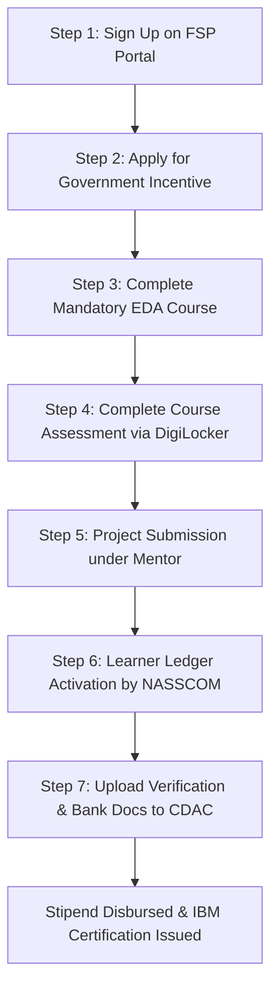

# IBM Collaborative Project-Based Experiential Learning (PBEL)

This repository documents and tracks the progress, curriculum, guidelines, and certificates achieved during the **IBM Collaborative Project-Based Experiential Learning (PBEL)** program, focusing on **Full Stack Web Development with JavaScript**. 

It serves as a central hub for all course materials, step-by-step processes, milestones, and program verifications.

---

## 📂 Repository Structure

Below is an overview of the documents, certificates, and screenshots tracking the PBEL journey:

*   📄 **[syllabus.pdf](syllabus.pdf)** — The official syllabus for the IBM "Full Stack Web Development with JavaScript" course.
*   📄 **[PBEL_Process.pdf](PBEL_Process.pdf)** — Step-wise guide detailing the registration, certification, and stipend disbursement process.
*   📁 **[Certificate/](Certificate/)** — Verification of course completion and assessment success.
    *   📜 **[Vaibhav_Gupta_Exploratory Data Analysis.pdf](Certificate/Vaibhav_Gupta_Exploratory_Data_Analysis.pdf)** — NASSCOM certificate of completion for the mandatory Exploratory Data Analysis course.
    *   📜 **[Vaibhav+Gupta_163129260.pdf](Certificate/Vaibhav+Gupta_163129260.pdf)** — NASSCOM Gold Category Assessment Certificate (Score: 75/100).
*   📁 **[ScreenShots/](ScreenShots/)** — Proof of registration, profile updates, and portal status.
    *   🖼️ **[FSP (1).png](ScreenShots/FSP%20(1).png)** — Success message for updating basic profile details on FutureSkills Prime (FSP).
    *   🖼️ **[FSP (2).png](ScreenShots/FSP%20(2).png)** — Mr. Vaibhav Gupta's FSP portal profile dashboard.
    *   🖼️ **[GOI.png](ScreenShots/GOI.png)** — Successful registration confirmation for the Government of India (GOI) Incentive.
    *   🖼️ **[project.png](ScreenShots/project.png)** — Project options outline from the course syllabus.

---

## 🛠️ Course Curriculum: Full Stack Web Development with JavaScript (IBM)

The program is structured to provide end-to-end expertise in modern web development using the JavaScript ecosystem.

### Course Objectives
1. Identify the core technologies in full-stack JavaScript development.
2. Explain the architecture of web applications (frontend vs. backend roles).
3. Build responsive and interactive frontends using HTML5, CSS3, TailwindCSS, JavaScript, and React.
4. Develop robust server-side applications using Node.js, Express.js, and EJS.
5. Integrate MongoDB databases and implement RESTful APIs.
6. Deploy and optimize web applications for performance, security, and SEO.

### Learning Modules
*   **Module I: Frontend Development Basics (6 Hours)**
    *   Client-server architecture overview.
    *   HTML5 & CSS3 essentials.
    *   Utility-first styling with TailwindCSS.
    *   JS Fundamentals: DOM, events, arrays, loops, and functions.
*   **Module II: Server-Side Development with Node.js & Express.js (10 Hours)**
    *   Asynchronous JS and event-driven architecture.
    *   Working with NPM.
    *   Express.js fundamentals: Routing, Middleware, and Request Handling.
    *   Server-rendered pages using EJS Templating.
    *   File handling and form data in Express.
*   **Module III: Database and API Development (10 Hours)**
    *   NoSQL data modeling with MongoDB.
    *   CRUD operations using Mongoose.
    *   RESTful API design and integration.
    *   User authentication using JWT and sessions.
    *   Role-based access control and secure endpoints.
*   **Module IV: Advanced Frontend with React.js (10 Hours)**
    *   React components, props, and state.
    *   Functional components & React Hooks (`useState`, `useEffect`).
    *   Routing with React Router.
    *   State management via Context API.
    *   Integrating REST APIs into React frontends.
*   **Module V: Full-Stack Project Development & Deployment (8 Hours)**
    *   Building a complete web application.
    *   Connecting frontend and backend using REST APIs.
    *   Deploying applications to platforms like Heroku, Netlify, or Vercel.
    *   Best practices: Code organization, error handling, and performance optimization.
*   **Module VI: Website Launch and SEO Optimization (6 Hours)**
    *   Launch strategy: Social media, email marketing, and paid ads.
    *   Keyword research & on-page SEO optimization.
    *   Title, meta-tag, and content structure optimization.
    *   Content planning for traffic growth.
    *   Analytics tracking via Google Analytics and Search Console.

### Selected Program Project: L'Étoile Monospaced 🍔

For the final project submission of this internship, the **Food Ordering Website** option was selected. The project is developed and hosted in a separate repository:

👉 **[vaibhv19/Food-Ordering-System](https://github.com/vaibhv19/Food-Ordering-System)**

#### 📝 Project Overview
**L'Étoile Monospaced** is a simulated food ordering web application built as part of *Module IV (Advanced Frontend with React.js)* and *Module V (Full-Stack Project Development)* of the IBM curriculum.

*   **Core Concept:** Simulates a restaurant/cafe ordering workflow. Users can browse dishes by category, view ingredients and preparation instructions, manage item quantities in a guest check cart drawer, and process checkout to generate a kitchen order ticket receipt.
*   **Tech Stack:**
    *   **Frontend:** React.js (Functional components, React Hooks, Context API for global cart state).
    *   **Routing:** React Router (client-side routing).
    *   **Styling:** TailwindCSS (customized with vintage paper colors and monospaced typography).
    *   **Build Tool:** Vite.
    *   **API Integration:** Fetches category and dish details dynamically from [TheMealDB](https://www.themealdb.com/).
    *   **Pricing:** Generated deterministically on the client side using meal IDs (ensuring stable pricing across browsing sessions).
*   **Key Features:**
    *   Horizontal scrolling food category selector tabs.
    *   Responsive menu grid featuring custom styled food cards.
    *   Dynamic modal popups showing ingredients and preparation steps.
    *   A guest-check-themed slide-out shopping cart drawer.
    *   Simulated kitchen ticket checkout receipt screen.

---

## 📈 The PBEL Step-by-Step Process

The program incorporates government-backed incentives and formal certification. Below is the step-by-step process followed by learners:

1.  **Sign Up on FSP Portal**: Register at the [FutureSkills Prime Portal](https://www.futureskillsprime.in/iDH/fsp/SignUp) using a consistent email address and matching official identification details.
2.  **Apply for Government Incentive**: Submit an application for the Government of India (GOI) Incentive form.
3.  **Complete the NASSCOM Course**: Enroll in and complete the mandatory **Exploratory Data Analysis (EDA)** course (a requirement for all tracks).
4.  **Complete the Assessment**: Verify account details with DigiLocker and complete the course assessment on the NASSCOM portal.
5.  **Project Submission**: Develop and submit the final full-stack project under the guidance of a mentor to gain access to the IBM Certification.
6.  **Activate Learner Ledger**: Open the "Learner Ledger / My Ledger" section on the FSP portal and click "Apply for Incentive" to transition the status to "Incentive in Progress."
7.  **Upload Documents on CDAC Portal**: Upon receiving an email from CDAC, upload a photograph, a self-attested government ID proof, and self-attested bank details for stipend disbursement.

---

## 🏆 Achieved Milestones & Certificates

*   **Exploratory Data Analysis (Mandatory Course)**
    *   **Completion Date:** July 25, 2026.
    *   **Assessment Status:** Passed on August 5, 2026, achieving a **Gold Category** designation (Score: 75%).
    *   *Certificates are saved in the `Certificate/` directory.*
